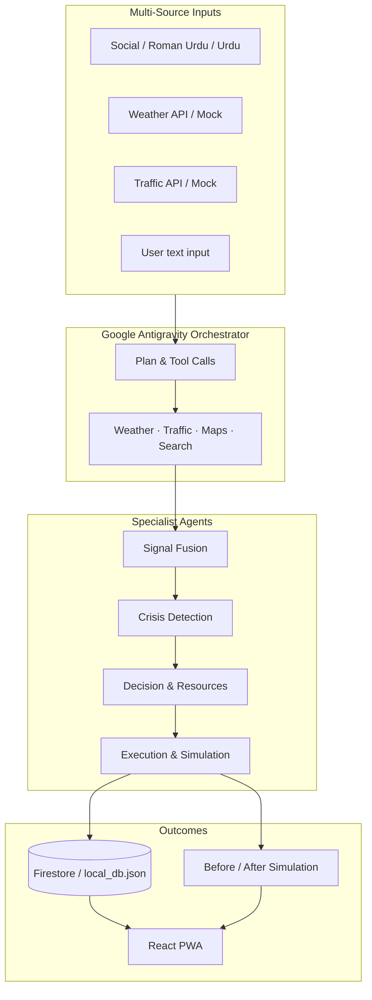

# CIRO Pakistan — Crisis Intelligence & Response Orchestrator

**Challenge 3:** Agentic AI system that ingests multi-source crisis signals, detects emerging situations, plans coordinated responses, simulates execution, and visualizes outcomes — built for Pakistani metros (floods, heatwaves, accidents, infrastructure failures).

## Deliverables

| Deliverable | Location |
|-------------|----------|
| **Mobile-first web app (PWA)** | `src/` — installable on phone via browser “Add to Home Screen” |
| **Backend API** | `backend/` — FastAPI multi-agent pipeline |
| **Agent traces / logs** | Dashboard → Agent Logs, `GET /api/agent-traces` |
| **Documentation** | This file + `backend/README.md` + `DEPLOYMENT.md` |

## System Architecture



## Google Antigravity Usage (Mandatory)

The **Google Antigravity Orchestrator** (`backend/orchestration/antigravity_orchestrator.py`) is the top-level coordinator:

1. **Plans** the response using Antigravity / Gemini (tool-aware prompt).
2. **Integrates tools** — weather (`OpenWeather` + mock), traffic (`mock_traffic.json`), social search (`mock_social_posts.json`), Google Maps routing (or polyline fallback).
3. **Delegates** to four sub-agents in sequence: Fusion → Detection → Decision → Execution.
4. **Simulates** rerouting, emergency dispatch, public alerts, and tickets.
5. **Logs** every step to agent traces (including orchestrator `agent_id: 0`).

### Enable Antigravity SDK (optional)

```bash
pip install google-antigravity
export ANTIGRAVITY_AGENT=1
export GEMINI_API_KEY=your-key
```

Without the SDK, the same orchestration contract runs using **Gemini 2.0 Flash** + structured sub-agents (fully offline-capable with mock data).

## Quick Start

### Backend

```bash
cd ciro-pakistan/backend
pip install -r requirements.txt
python main.py
```

API docs: http://localhost:8000/docs

### Frontend (mobile PWA)

```bash
cd ciro-pakistan
npm install
npm run dev
```

Open http://localhost:5173 → Splash → **Enter Command Center** → **Run Full Agent Pipeline** on Dashboard.

Set `VITE_API_URL=http://localhost:8000` in `.env` if the API is remote.

## End-to-End Demo Flow (3–5 min video)

1. **Intel Feed** — show G-10 social, weather, traffic signals (Roman Urdu + English).
2. **Dashboard** — click **Run Full Agent Pipeline** (Antigravity orchestration).
3. **Agent Logs** — reasoning traces from Orchestrator + 4 agents.
4. **Alerts** — simulated dispatch, reroute, bilingual alerts, ticket IDs.
5. **Simulation** — before/after metrics (casualties ↓, coverage ↑).
6. **Map** — crisis markers and routes.

### Example scenario (challenge brief)

**Inputs:**  
- Social: `"G-10 mein pani bhar gaya hai, gaariyan phans gayi hain"`  
- Weather: heavy rainfall alert  
- Traffic: congestion spike  

**Expected output:** Urban flooding (G-10) · High confidence · Traffic blocked · Actions: reroute, dispatch, alerts · Simulated tickets & map updates.

## API Highlights

| Endpoint | Purpose |
|----------|---------|
| `POST /api/analyze-crisis` | Full Antigravity + agent pipeline |
| `GET /api/mock-signals` | Demo signal bundle |
| `GET /api/agent-traces` | Agent reasoning log |
| `GET /api/simulation` | Latest before/after state |
| `WS /api/ws` | Live workflow events (optional) |
| `GET /api/weather/{city}` | Live telemetry |
| `GET /api/route` | Directions / fallback polyline |

## Tools & APIs

| Tool | Implementation |
|------|----------------|
| Gemini | `google-generativeai` — structured agent outputs |
| OpenWeather | `WEATHER_API_KEY` or `mock_weather.json` |
| Google Maps | `GOOGLE_MAPS_API_KEY` or Haversine fallback |
| Firebase | `GOOGLE_APPLICATION_CREDENTIALS` or `data/local_db.json` |
| Antigravity | `google-antigravity` when `ANTIGRAVITY_AGENT=1` |

## Assumptions

- No real emergency dispatch; all actions are **simulated** with tickets and status updates.
- Social/traffic feeds use **mock JSON** unless API keys are configured.
- Roman Urdu and Urdu posts are translated/normalized in the Signal Fusion agent.
- F-7 “flood” vs WASA burst-pipe scenario demonstrates **adaptive reclassification** when contradiction signals exist in the full mock set.

## Project Structure

```
ciro-pakistan/
├── backend/
│   ├── orchestration/     # Google Antigravity orchestrator + tools
│   ├── agents/            # 4 specialist agents
│   ├── routes/            # REST + WebSocket
│   └── data/              # Mock weather, traffic, social
├── src/                   # React PWA (mobile-first)
└── public/manifest.webmanifest
```

## Team / Evaluation Alignment

- **Antigravity (25%)** — Central orchestrator with tool integration and multi-agent delegation.
- **Agentic reasoning (20%)** — OODA workflow, traces, inter-agent handoffs.
- **Detection (20%)** — Multi-signal fusion, confidence, Urdu/Roman Urdu handling.
- **Simulation (15%)** — Reroute, dispatch, alerts, before/after metrics.
- **Technical (10%)** — FastAPI + React, polling/WebSocket, offline fallbacks.
- **UX (10%)** — Mobile PWA, live telemetry, clear demo path.
